# DATABASE SCHEMA — Website Resmi STTPU
**Versi:** 1.0.0
**Tanggal:** 2026-04-18
**Database:** PostgreSQL 15+
**Dibuat oleh:** Database Optimizer Agent

---

## Daftar Isi

1. [ERD (Entity Relationship Diagram)](#erd)
2. [DDL SQL](#ddl-sql)
3. [Keputusan Desain](#keputusan-desain)
4. [Query Examples](#query-examples)
5. [Indexing Strategy](#indexing-strategy)

---

## ERD

```mermaid
erDiagram
    users {
        bigserial id PK
        varchar email
        varchar password_hash
        varchar name
        bigint role_id FK
        timestamptz deleted_at
        timestamptz created_at
    }

    roles {
        bigserial id PK
        varchar name
        jsonb permissions
    }

    sessions {
        bigserial id PK
        bigint user_id FK
        varchar token
        timestamptz expires_at
    }

    site_settings {
        bigserial id PK
        varchar key
        text value
        varchar type
    }

    social_links {
        bigserial id PK
        varchar platform
        varchar url
        integer sort_order
    }

    institution_stats {
        bigserial id PK
        varchar stat_key
        varchar value
        jsonb label
    }

    programs {
        bigserial id PK
        jsonb name
        jsonb description
        varchar degree_level
        varchar accreditation_grade
        boolean is_active
        timestamptz deleted_at
    }

    program_curriculum {
        bigserial id PK
        bigint program_id FK
        jsonb course_name
        varchar course_code
        integer credits
        integer semester
    }

    scholarships {
        bigserial id PK
        jsonb title
        jsonb description
        varchar type
        boolean is_active
    }

    lecturers {
        bigserial id PK
        varchar name
        varchar nidn
        varchar email
        bigint program_id FK
        jsonb research_interests
        varchar academic_position
        timestamptz deleted_at
    }

    lecturer_publications {
        bigserial id PK
        bigint lecturer_id FK
        jsonb title
        varchar journal
        integer year
        varchar doi
    }

    research_units {
        bigserial id PK
        jsonb name
        jsonb description
        bigint head_lecturer_id FK
    }

    research_grants {
        bigserial id PK
        bigint research_unit_id FK
        jsonb title
        varchar funding_source
        integer year
        numeric amount
    }

    post_categories {
        bigserial id PK
        jsonb name
        varchar slug
        bigint parent_id FK
    }

    posts {
        bigserial id PK
        jsonb title
        jsonb content
        varchar slug
        varchar status
        bigint author_id FK
        varchar author_name
        bigint category_id FK
        timestamptz published_at
        timestamptz deleted_at
    }

    post_tags {
        bigserial id PK
        jsonb name
        varchar slug
    }

    post_tag_relations {
        bigint post_id FK
        bigint tag_id FK
    }

    post_media {
        bigserial id PK
        bigint post_id FK
        varchar url
        varchar type
        integer sort_order
    }

    pages {
        bigserial id PK
        jsonb title
        jsonb content
        varchar slug
        varchar status
        bigint author_id FK
    }

    faqs {
        bigserial id PK
        jsonb question
        jsonb answer
        varchar category
        integer sort_order
        boolean is_active
    }

    testimonials {
        bigserial id PK
        varchar name
        varchar role
        text content
        varchar avatar_url
        boolean is_active
    }

    facilities {
        bigserial id PK
        jsonb name
        jsonb description
        varchar category
        varchar image_url
        boolean is_active
    }

    organization_members {
        bigserial id PK
        varchar name
        varchar position
        jsonb title
        varchar photo_url
        integer sort_order
        boolean is_active
    }

    accreditations {
        bigserial id PK
        bigint program_id FK
        varchar body
        varchar grade
        date valid_until
        varchar certificate_url
    }

    partnerships {
        bigserial id PK
        jsonb name
        varchar type
        varchar logo_url
        varchar website_url
        boolean is_active
    }

    student_achievements {
        bigserial id PK
        jsonb title
        varchar level
        integer year
        bigint program_id FK
        varchar image_url
    }

    student_organizations {
        bigserial id PK
        jsonb name
        jsonb description
        varchar logo_url
        boolean is_active
    }

    student_services {
        bigserial id PK
        jsonb name
        jsonb description
        varchar icon
        varchar link
        integer sort_order
    }

    academic_calendars {
        bigserial id PK
        jsonb event_name
        date start_date
        date end_date
        integer academic_year
        varchar semester
    }

    media_albums {
        bigserial id PK
        jsonb title
        varchar cover_url
        timestamptz captured_at
        boolean is_published
    }

    media_items {
        bigserial id PK
        bigint album_id FK
        varchar url
        varchar type
        jsonb caption
        integer sort_order
    }

    contact_messages {
        bigserial id PK
        varchar name
        varchar email
        varchar subject
        text message
        varchar status
        timestamptz created_at
    }

    contact_directory {
        bigserial id PK
        jsonb department_name
        varchar phone
        varchar email
        varchar address
        integer sort_order
    }

    newsletters {
        bigserial id PK
        varchar email
        varchar status
        timestamptz subscribed_at
        timestamptz unsubscribed_at
    }

    users ||--o{ sessions : "has"
    users }o--|| roles : "has"
    users ||--o{ posts : "authors"
    users ||--o{ pages : "authors"
    programs ||--o{ program_curriculum : "has"
    programs ||--o{ lecturers : "employs"
    programs ||--o{ accreditations : "has"
    programs ||--o{ student_achievements : "associated"
    lecturers ||--o{ lecturer_publications : "writes"
    research_units ||--o{ research_grants : "receives"
    research_units }o--|| lecturers : "headed by"
    posts }o--|| post_categories : "belongs to"
    posts ||--o{ post_tag_relations : "tagged with"
    posts ||--o{ post_media : "has"
    post_tags ||--o{ post_tag_relations : "used in"
    post_categories ||--o{ post_categories : "parent of"
    media_albums ||--o{ media_items : "contains"
```



---

## DDL SQL

```sql
-- ============================================================
-- EXTENSIONS
-- ============================================================
CREATE EXTENSION IF NOT EXISTS "pgcrypto";  -- for gen_random_uuid()
CREATE EXTENSION IF NOT EXISTS "pg_trgm";   -- for trigram full-text search
CREATE EXTENSION IF NOT EXISTS "unaccent";  -- for accent-insensitive search

-- ============================================================
-- CUSTOM TYPES
-- ============================================================

CREATE TYPE content_status AS ENUM ('draft', 'published', 'archived');
CREATE TYPE contact_message_status AS ENUM ('unread', 'read', 'replied', 'archived');
CREATE TYPE newsletter_status AS ENUM ('active', 'unsubscribed');
CREATE TYPE media_type AS ENUM ('image', 'video', 'document');

-- ============================================================
-- DOMAIN: AUTH & PORTAL
-- ============================================================

CREATE TABLE roles (
    id          BIGSERIAL PRIMARY KEY,
    name        VARCHAR(100) NOT NULL UNIQUE,           -- e.g. 'admin', 'editor', 'lecturer'
    permissions JSONB NOT NULL DEFAULT '{}',            -- structured permission flags
    created_at  TIMESTAMPTZ NOT NULL DEFAULT NOW(),
    updated_at  TIMESTAMPTZ NOT NULL DEFAULT NOW()
);

CREATE TABLE users (
    id            BIGSERIAL PRIMARY KEY,
    email         VARCHAR(255) NOT NULL,
    password_hash VARCHAR(255) NOT NULL,
    name          VARCHAR(255) NOT NULL,
    role_id       BIGINT NOT NULL REFERENCES roles(id) ON DELETE RESTRICT,
    avatar_url    VARCHAR(500),
    is_active     BOOLEAN NOT NULL DEFAULT TRUE,
    last_login_at TIMESTAMPTZ,
    deleted_at    TIMESTAMPTZ,                          -- soft delete
    created_at    TIMESTAMPTZ NOT NULL DEFAULT NOW(),
    updated_at    TIMESTAMPTZ NOT NULL DEFAULT NOW()
);

CREATE UNIQUE INDEX idx_users_email_active
    ON users(email)
    WHERE deleted_at IS NULL;

CREATE INDEX idx_users_role_id ON users(role_id);

CREATE TABLE sessions (
    id         BIGSERIAL PRIMARY KEY,
    user_id    BIGINT NOT NULL REFERENCES users(id) ON DELETE CASCADE,
    token      VARCHAR(512) NOT NULL UNIQUE,           -- hashed session token
    ip_address INET,
    user_agent TEXT,
    expires_at TIMESTAMPTZ NOT NULL,
    created_at TIMESTAMPTZ NOT NULL DEFAULT NOW()
);

CREATE INDEX idx_sessions_user_id   ON sessions(user_id);
CREATE INDEX idx_sessions_token     ON sessions(token);
CREATE INDEX idx_sessions_expires   ON sessions(expires_at);

-- ============================================================
-- DOMAIN: SITE CONFIGURATION
-- ============================================================

CREATE TABLE site_settings (
    id         BIGSERIAL PRIMARY KEY,
    key        VARCHAR(100) NOT NULL UNIQUE,           -- e.g. 'site_name', 'logo_url'
    value      TEXT,
    type       VARCHAR(20) NOT NULL DEFAULT 'string',  -- 'string', 'json', 'boolean', 'number'
    group_name VARCHAR(100),                           -- logical grouping for admin UI
    updated_at TIMESTAMPTZ NOT NULL DEFAULT NOW()
);

CREATE INDEX idx_site_settings_group ON site_settings(group_name);

CREATE TABLE social_links (
    id         BIGSERIAL PRIMARY KEY,
    platform   VARCHAR(100) NOT NULL,                 -- 'instagram', 'youtube', 'twitter', etc.
    url        VARCHAR(500) NOT NULL,
    icon       VARCHAR(100),                          -- icon identifier for frontend
    sort_order INTEGER NOT NULL DEFAULT 0,
    is_active  BOOLEAN NOT NULL DEFAULT TRUE,
    updated_at TIMESTAMPTZ NOT NULL DEFAULT NOW()
);

CREATE TABLE institution_stats (
    id        BIGSERIAL PRIMARY KEY,
    stat_key  VARCHAR(100) NOT NULL UNIQUE,           -- e.g. 'total_students', 'total_lecturers'
    value     VARCHAR(100) NOT NULL,                  -- stored as string to allow formatting
    label     JSONB NOT NULL DEFAULT '{}',            -- {"id": "Total Mahasiswa", "en": "Total Students"}
    icon      VARCHAR(100),
    sort_order INTEGER NOT NULL DEFAULT 0,
    updated_at TIMESTAMPTZ NOT NULL DEFAULT NOW()
);

-- ============================================================
-- DOMAIN: ACADEMIC PROGRAMS
-- ============================================================

CREATE TABLE programs (
    id                   BIGSERIAL PRIMARY KEY,
    name                 JSONB NOT NULL,               -- {"id": "Teknik Informatika", "en": "Informatics Engineering"}
    description          JSONB NOT NULL DEFAULT '{}',
    slug                 VARCHAR(255) NOT NULL UNIQUE,
    degree_level         VARCHAR(10) NOT NULL,          -- 'D3', 'D4', 'S1', 'S2', 'S3'
    accreditation_grade  VARCHAR(20),                   -- snapshot; canonical in accreditations table
    head_lecturer_id     BIGINT,                        -- set after lecturers table is populated
    vision               JSONB NOT NULL DEFAULT '{}',
    mission              JSONB NOT NULL DEFAULT '{}',
    prospects            JSONB NOT NULL DEFAULT '{}',   -- career prospects text
    cover_image_url      VARCHAR(500),
    is_active            BOOLEAN NOT NULL DEFAULT TRUE,
    sort_order           INTEGER NOT NULL DEFAULT 0,
    deleted_at           TIMESTAMPTZ,
    created_at           TIMESTAMPTZ NOT NULL DEFAULT NOW(),
    updated_at           TIMESTAMPTZ NOT NULL DEFAULT NOW()
);

CREATE INDEX idx_programs_active ON programs(is_active) WHERE deleted_at IS NULL;

CREATE TABLE program_curriculum (
    id          BIGSERIAL PRIMARY KEY,
    program_id  BIGINT NOT NULL REFERENCES programs(id) ON DELETE CASCADE,
    course_name JSONB NOT NULL,                        -- {"id": "Algoritma dan Pemrograman", "en": "Algorithms and Programming"}
    course_code VARCHAR(20) NOT NULL,
    credits     INTEGER NOT NULL CHECK (credits > 0),
    semester    INTEGER NOT NULL CHECK (semester BETWEEN 1 AND 14),
    is_elective BOOLEAN NOT NULL DEFAULT FALSE,
    created_at  TIMESTAMPTZ NOT NULL DEFAULT NOW(),
    updated_at  TIMESTAMPTZ NOT NULL DEFAULT NOW(),
    UNIQUE (program_id, course_code)
);

CREATE INDEX idx_curriculum_program_id  ON program_curriculum(program_id);
CREATE INDEX idx_curriculum_semester    ON program_curriculum(program_id, semester);

CREATE TABLE scholarships (
    id           BIGSERIAL PRIMARY KEY,
    title        JSONB NOT NULL,                       -- {"id": "Beasiswa Prestasi", "en": "Merit Scholarship"}
    description  JSONB NOT NULL DEFAULT '{}',
    type         VARCHAR(50) NOT NULL,                 -- 'internal', 'government', 'private'
    requirements JSONB NOT NULL DEFAULT '[]',          -- array of requirement strings
    benefits     JSONB NOT NULL DEFAULT '[]',
    is_active    BOOLEAN NOT NULL DEFAULT TRUE,
    sort_order   INTEGER NOT NULL DEFAULT 0,
    created_at   TIMESTAMPTZ NOT NULL DEFAULT NOW(),
    updated_at   TIMESTAMPTZ NOT NULL DEFAULT NOW()
);

-- ============================================================
-- DOMAIN: LECTURERS & RESEARCH
-- ============================================================

CREATE TABLE lecturers (
    id                  BIGSERIAL PRIMARY KEY,
    name                VARCHAR(255) NOT NULL,
    nidn                VARCHAR(20) UNIQUE,             -- Nomor Induk Dosen Nasional
    email               VARCHAR(255),
    program_id          BIGINT REFERENCES programs(id) ON DELETE SET NULL,
    photo_url           VARCHAR(500),
    academic_position   VARCHAR(100),                   -- 'Asisten Ahli', 'Lektor', 'Lektor Kepala', 'Profesor'
    last_degree         VARCHAR(10),                    -- 'S2', 'S3'
    degree_institution  VARCHAR(255),
    research_interests  JSONB NOT NULL DEFAULT '[]',    -- array of interest strings
    scopus_id           VARCHAR(100),
    google_scholar_url  VARCHAR(500),
    biography           TEXT,
    is_active           BOOLEAN NOT NULL DEFAULT TRUE,
    deleted_at          TIMESTAMPTZ,
    created_at          TIMESTAMPTZ NOT NULL DEFAULT NOW(),
    updated_at          TIMESTAMPTZ NOT NULL DEFAULT NOW()
);

CREATE INDEX idx_lecturers_program_id ON lecturers(program_id);
CREATE INDEX idx_lecturers_nidn       ON lecturers(nidn) WHERE nidn IS NOT NULL;

-- Add FK constraint for programs.head_lecturer_id after lecturers is created
ALTER TABLE programs
    ADD CONSTRAINT fk_programs_head_lecturer
    FOREIGN KEY (head_lecturer_id) REFERENCES lecturers(id) ON DELETE SET NULL;

CREATE TABLE lecturer_publications (
    id            BIGSERIAL PRIMARY KEY,
    lecturer_id   BIGINT NOT NULL REFERENCES lecturers(id) ON DELETE CASCADE,
    title         JSONB NOT NULL,
    journal       VARCHAR(500),
    year          INTEGER NOT NULL CHECK (year > 1900),
    doi           VARCHAR(255),
    url           VARCHAR(500),
    citation_count INTEGER NOT NULL DEFAULT 0,
    publication_type VARCHAR(50) NOT NULL DEFAULT 'journal', -- 'journal', 'conference', 'book'
    created_at    TIMESTAMPTZ NOT NULL DEFAULT NOW(),
    updated_at    TIMESTAMPTZ NOT NULL DEFAULT NOW()
);

CREATE INDEX idx_publications_lecturer_id ON lecturer_publications(lecturer_id);
CREATE INDEX idx_publications_year        ON lecturer_publications(year DESC);

CREATE TABLE research_units (
    id               BIGSERIAL PRIMARY KEY,
    name             JSONB NOT NULL,                   -- {"id": "Pusat Studi AI", "en": "AI Research Center"}
    description      JSONB NOT NULL DEFAULT '{}',
    head_lecturer_id BIGINT REFERENCES lecturers(id) ON DELETE SET NULL,
    logo_url         VARCHAR(500),
    is_active        BOOLEAN NOT NULL DEFAULT TRUE,
    created_at       TIMESTAMPTZ NOT NULL DEFAULT NOW(),
    updated_at       TIMESTAMPTZ NOT NULL DEFAULT NOW()
);

CREATE TABLE research_grants (
    id               BIGSERIAL PRIMARY KEY,
    research_unit_id BIGINT REFERENCES research_units(id) ON DELETE SET NULL,
    title            JSONB NOT NULL,
    funding_source   VARCHAR(255) NOT NULL,             -- 'DIKTI', 'Mandiri', 'International', etc.
    year             INTEGER NOT NULL CHECK (year > 1900),
    amount           NUMERIC(15, 2),
    status           VARCHAR(50) NOT NULL DEFAULT 'ongoing', -- 'ongoing', 'completed'
    abstract         JSONB NOT NULL DEFAULT '{}',
    created_at       TIMESTAMPTZ NOT NULL DEFAULT NOW(),
    updated_at       TIMESTAMPTZ NOT NULL DEFAULT NOW()
);

CREATE INDEX idx_grants_research_unit_id ON research_grants(research_unit_id);
CREATE INDEX idx_grants_year             ON research_grants(year DESC);

-- ============================================================
-- DOMAIN: POSTS (BERITA & PENGUMUMAN)
-- ============================================================

CREATE TABLE post_categories (
    id         BIGSERIAL PRIMARY KEY,
    name       JSONB NOT NULL,                         -- {"id": "Berita", "en": "News"}
    slug       VARCHAR(255) NOT NULL UNIQUE,
    parent_id  BIGINT REFERENCES post_categories(id) ON DELETE SET NULL,
    sort_order INTEGER NOT NULL DEFAULT 0,
    created_at TIMESTAMPTZ NOT NULL DEFAULT NOW(),
    updated_at TIMESTAMPTZ NOT NULL DEFAULT NOW()
);

CREATE INDEX idx_post_categories_parent ON post_categories(parent_id);

CREATE TABLE posts (
    id            BIGSERIAL PRIMARY KEY,
    title         JSONB NOT NULL,                      -- {"id": "Judul Berita", "en": "News Title"}
    content       JSONB NOT NULL DEFAULT '{}',         -- {"id": "<html>...", "en": "<html>..."}
    excerpt       JSONB NOT NULL DEFAULT '{}',         -- short summary for listing pages
    slug          VARCHAR(255) NOT NULL UNIQUE,
    status        content_status NOT NULL DEFAULT 'draft',
    cover_image   VARCHAR(500),
    author_id     BIGINT REFERENCES users(id) ON DELETE SET NULL,
    author_name   VARCHAR(255) NOT NULL,               -- denormalized snapshot at publish time
    category_id   BIGINT REFERENCES post_categories(id) ON DELETE SET NULL,
    view_count    INTEGER NOT NULL DEFAULT 0,
    is_featured   BOOLEAN NOT NULL DEFAULT FALSE,
    published_at  TIMESTAMPTZ,
    deleted_at    TIMESTAMPTZ,                         -- soft delete
    created_at    TIMESTAMPTZ NOT NULL DEFAULT NOW(),
    updated_at    TIMESTAMPTZ NOT NULL DEFAULT NOW()
);

-- Primary listing query: published posts sorted by date
CREATE INDEX idx_posts_status_published
    ON posts(status, published_at DESC)
    WHERE deleted_at IS NULL;

-- Featured posts on homepage
CREATE INDEX idx_posts_featured
    ON posts(is_featured, published_at DESC)
    WHERE status = 'published' AND deleted_at IS NULL;

-- Category filtering
CREATE INDEX idx_posts_category_id
    ON posts(category_id)
    WHERE deleted_at IS NULL;

-- Author lookup (admin panel)
CREATE INDEX idx_posts_author_id ON posts(author_id);

-- Full-text search on title (GIN trigram)
CREATE INDEX idx_posts_title_gin
    ON posts USING GIN ((title->>'id') gin_trgm_ops);

CREATE TABLE post_tags (
    id         BIGSERIAL PRIMARY KEY,
    name       JSONB NOT NULL,                         -- {"id": "Teknologi", "en": "Technology"}
    slug       VARCHAR(255) NOT NULL UNIQUE,
    created_at TIMESTAMPTZ NOT NULL DEFAULT NOW()
);

CREATE TABLE post_tag_relations (
    post_id    BIGINT NOT NULL REFERENCES posts(id) ON DELETE CASCADE,
    tag_id     BIGINT NOT NULL REFERENCES post_tags(id) ON DELETE CASCADE,
    PRIMARY KEY (post_id, tag_id)
);

CREATE INDEX idx_post_tag_relations_tag_id ON post_tag_relations(tag_id);

CREATE TABLE post_media (
    id         BIGSERIAL PRIMARY KEY,
    post_id    BIGINT NOT NULL REFERENCES posts(id) ON DELETE CASCADE,
    url        VARCHAR(500) NOT NULL,
    type       media_type NOT NULL DEFAULT 'image',
    alt_text   VARCHAR(500),
    sort_order INTEGER NOT NULL DEFAULT 0,
    created_at TIMESTAMPTZ NOT NULL DEFAULT NOW()
);

CREATE INDEX idx_post_media_post_id ON post_media(post_id);

-- ============================================================
-- DOMAIN: STATIC PAGES
-- ============================================================

CREATE TABLE pages (
    id           BIGSERIAL PRIMARY KEY,
    title        JSONB NOT NULL,
    content      JSONB NOT NULL DEFAULT '{}',
    slug         VARCHAR(255) NOT NULL UNIQUE,
    status       content_status NOT NULL DEFAULT 'draft',
    meta_title   JSONB NOT NULL DEFAULT '{}',
    meta_desc    JSONB NOT NULL DEFAULT '{}',
    author_id    BIGINT REFERENCES users(id) ON DELETE SET NULL,
    published_at TIMESTAMPTZ,
    created_at   TIMESTAMPTZ NOT NULL DEFAULT NOW(),
    updated_at   TIMESTAMPTZ NOT NULL DEFAULT NOW()
);

CREATE INDEX idx_pages_status   ON pages(status);
CREATE INDEX idx_pages_slug     ON pages(slug);

-- ============================================================
-- DOMAIN: SUPPORTING CONTENT
-- ============================================================

CREATE TABLE faqs (
    id         BIGSERIAL PRIMARY KEY,
    question   JSONB NOT NULL,                         -- {"id": "Apa syarat pendaftaran?", "en": "What are the requirements?"}
    answer     JSONB NOT NULL,
    category   VARCHAR(100),                           -- 'general', 'pmb', 'academic', 'finance'
    sort_order INTEGER NOT NULL DEFAULT 0,
    is_active  BOOLEAN NOT NULL DEFAULT TRUE,
    created_at TIMESTAMPTZ NOT NULL DEFAULT NOW(),
    updated_at TIMESTAMPTZ NOT NULL DEFAULT NOW()
);

CREATE INDEX idx_faqs_category ON faqs(category) WHERE is_active = TRUE;

CREATE TABLE testimonials (
    id         BIGSERIAL PRIMARY KEY,
    name       VARCHAR(255) NOT NULL,
    role       VARCHAR(255),                           -- 'Mahasiswa Aktif', 'Alumni 2022', etc.
    content    TEXT NOT NULL,
    avatar_url VARCHAR(500),
    program_id BIGINT REFERENCES programs(id) ON DELETE SET NULL,
    is_active  BOOLEAN NOT NULL DEFAULT TRUE,
    sort_order INTEGER NOT NULL DEFAULT 0,
    created_at TIMESTAMPTZ NOT NULL DEFAULT NOW(),
    updated_at TIMESTAMPTZ NOT NULL DEFAULT NOW()
);

CREATE INDEX idx_testimonials_program_id ON testimonials(program_id);

CREATE TABLE facilities (
    id          BIGSERIAL PRIMARY KEY,
    name        JSONB NOT NULL,                        -- {"id": "Laboratorium Komputer", "en": "Computer Laboratory"}
    description JSONB NOT NULL DEFAULT '{}',
    category    VARCHAR(100) NOT NULL,                 -- 'lab', 'library', 'sport', 'student_center'
    image_url   VARCHAR(500),
    capacity    INTEGER,
    is_active   BOOLEAN NOT NULL DEFAULT TRUE,
    sort_order  INTEGER NOT NULL DEFAULT 0,
    created_at  TIMESTAMPTZ NOT NULL DEFAULT NOW(),
    updated_at  TIMESTAMPTZ NOT NULL DEFAULT NOW()
);

CREATE INDEX idx_facilities_category ON facilities(category) WHERE is_active = TRUE;

CREATE TABLE organization_members (
    id          BIGSERIAL PRIMARY KEY,
    name        VARCHAR(255) NOT NULL,
    position    VARCHAR(255) NOT NULL,                 -- structural position code
    title       JSONB NOT NULL,                        -- {"id": "Ketua", "en": "Chairperson"}
    photo_url   VARCHAR(500),
    email       VARCHAR(255),
    phone       VARCHAR(50),
    sort_order  INTEGER NOT NULL DEFAULT 0,
    is_active   BOOLEAN NOT NULL DEFAULT TRUE,
    created_at  TIMESTAMPTZ NOT NULL DEFAULT NOW(),
    updated_at  TIMESTAMPTZ NOT NULL DEFAULT NOW()
);

CREATE TABLE accreditations (
    id               BIGSERIAL PRIMARY KEY,
    program_id       BIGINT REFERENCES programs(id) ON DELETE CASCADE,
    is_institutional BOOLEAN NOT NULL DEFAULT FALSE,   -- TRUE = institutional accreditation, not per program
    body             VARCHAR(255) NOT NULL,             -- 'BAN-PT', 'LAM-INFOKOM', 'ABET'
    grade            VARCHAR(20) NOT NULL,              -- 'A', 'B', 'Unggul', 'Baik Sekali', 'Baik'
    valid_from       DATE,
    valid_until      DATE,
    certificate_url  VARCHAR(500),
    decree_number    VARCHAR(255),
    created_at       TIMESTAMPTZ NOT NULL DEFAULT NOW(),
    updated_at       TIMESTAMPTZ NOT NULL DEFAULT NOW()
);

CREATE INDEX idx_accreditations_program_id ON accreditations(program_id);

CREATE TABLE partnerships (
    id          BIGSERIAL PRIMARY KEY,
    name        JSONB NOT NULL,                        -- {"id": "PT. Mitra Teknologi", "en": "PT. Mitra Teknologi"}
    type        VARCHAR(50) NOT NULL,                  -- 'industry', 'government', 'academic', 'international'
    logo_url    VARCHAR(500),
    website_url VARCHAR(500),
    description JSONB NOT NULL DEFAULT '{}',
    is_active   BOOLEAN NOT NULL DEFAULT TRUE,
    sort_order  INTEGER NOT NULL DEFAULT 0,
    created_at  TIMESTAMPTZ NOT NULL DEFAULT NOW(),
    updated_at  TIMESTAMPTZ NOT NULL DEFAULT NOW()
);

CREATE INDEX idx_partnerships_type ON partnerships(type) WHERE is_active = TRUE;

-- ============================================================
-- DOMAIN: STUDENT
-- ============================================================

CREATE TABLE student_achievements (
    id          BIGSERIAL PRIMARY KEY,
    title       JSONB NOT NULL,                        -- {"id": "Juara 1 Hackathon Nasional", "en": "1st Place National Hackathon"}
    description JSONB NOT NULL DEFAULT '{}',
    level       VARCHAR(50) NOT NULL,                  -- 'regional', 'national', 'international'
    year        INTEGER NOT NULL CHECK (year > 1900),
    program_id  BIGINT REFERENCES programs(id) ON DELETE SET NULL,
    image_url   VARCHAR(500),
    created_at  TIMESTAMPTZ NOT NULL DEFAULT NOW(),
    updated_at  TIMESTAMPTZ NOT NULL DEFAULT NOW()
);

CREATE INDEX idx_achievements_program_id ON student_achievements(program_id);
CREATE INDEX idx_achievements_year       ON student_achievements(year DESC);

CREATE TABLE student_organizations (
    id          BIGSERIAL PRIMARY KEY,
    name        JSONB NOT NULL,                        -- {"id": "Himpunan Mahasiswa Informatika", "en": "..."}
    description JSONB NOT NULL DEFAULT '{}',
    logo_url    VARCHAR(500),
    contact_email VARCHAR(255),
    is_active   BOOLEAN NOT NULL DEFAULT TRUE,
    sort_order  INTEGER NOT NULL DEFAULT 0,
    created_at  TIMESTAMPTZ NOT NULL DEFAULT NOW(),
    updated_at  TIMESTAMPTZ NOT NULL DEFAULT NOW()
);

CREATE TABLE student_services (
    id          BIGSERIAL PRIMARY KEY,
    name        JSONB NOT NULL,                        -- {"id": "Konseling Akademik", "en": "Academic Counseling"}
    description JSONB NOT NULL DEFAULT '{}',
    icon        VARCHAR(100),                          -- icon identifier for frontend
    link        VARCHAR(500),                          -- external URL or internal route
    sort_order  INTEGER NOT NULL DEFAULT 0,
    is_active   BOOLEAN NOT NULL DEFAULT TRUE,
    created_at  TIMESTAMPTZ NOT NULL DEFAULT NOW(),
    updated_at  TIMESTAMPTZ NOT NULL DEFAULT NOW()
);

CREATE TABLE academic_calendars (
    id            BIGSERIAL PRIMARY KEY,
    event_name    JSONB NOT NULL,                      -- {"id": "Ujian Tengah Semester", "en": "Midterm Examination"}
    start_date    DATE NOT NULL,
    end_date      DATE NOT NULL CHECK (end_date >= start_date),
    academic_year INTEGER NOT NULL,                    -- e.g. 2025 means 2025/2026
    semester      VARCHAR(10) NOT NULL,                -- 'odd', 'even', 'short'
    category      VARCHAR(50) NOT NULL DEFAULT 'academic', -- 'academic', 'holiday', 'event'
    created_at    TIMESTAMPTZ NOT NULL DEFAULT NOW(),
    updated_at    TIMESTAMPTZ NOT NULL DEFAULT NOW()
);

CREATE INDEX idx_academic_cal_year_sem ON academic_calendars(academic_year, semester);
CREATE INDEX idx_academic_cal_dates    ON academic_calendars(start_date, end_date);

-- ============================================================
-- DOMAIN: MEDIA GALLERY
-- ============================================================

CREATE TABLE media_albums (
    id           BIGSERIAL PRIMARY KEY,
    title        JSONB NOT NULL,                       -- {"id": "Wisuda 2025", "en": "Graduation 2025"}
    description  JSONB NOT NULL DEFAULT '{}',
    cover_url    VARCHAR(500),
    captured_at  TIMESTAMPTZ,
    is_published BOOLEAN NOT NULL DEFAULT FALSE,
    created_at   TIMESTAMPTZ NOT NULL DEFAULT NOW(),
    updated_at   TIMESTAMPTZ NOT NULL DEFAULT NOW()
);

CREATE INDEX idx_media_albums_published ON media_albums(captured_at DESC) WHERE is_published = TRUE;

CREATE TABLE media_items (
    id         BIGSERIAL PRIMARY KEY,
    album_id   BIGINT NOT NULL REFERENCES media_albums(id) ON DELETE CASCADE,
    url        VARCHAR(500) NOT NULL,
    type       media_type NOT NULL DEFAULT 'image',
    caption    JSONB NOT NULL DEFAULT '{}',
    sort_order INTEGER NOT NULL DEFAULT 0,
    created_at TIMESTAMPTZ NOT NULL DEFAULT NOW()
);

CREATE INDEX idx_media_items_album_id ON media_items(album_id, sort_order);

-- ============================================================
-- DOMAIN: CONTACT
-- ============================================================

CREATE TABLE contact_messages (
    id         BIGSERIAL PRIMARY KEY,
    name       VARCHAR(255) NOT NULL,
    email      VARCHAR(255) NOT NULL,
    phone      VARCHAR(50),
    subject    VARCHAR(500) NOT NULL,
    message    TEXT NOT NULL,
    status     contact_message_status NOT NULL DEFAULT 'unread',
    ip_address INET,
    created_at TIMESTAMPTZ NOT NULL DEFAULT NOW(),
    updated_at TIMESTAMPTZ NOT NULL DEFAULT NOW()
);

CREATE INDEX idx_contact_msg_status    ON contact_messages(status, created_at DESC);
CREATE INDEX idx_contact_msg_email     ON contact_messages(email);

CREATE TABLE contact_directory (
    id              BIGSERIAL PRIMARY KEY,
    department_name JSONB NOT NULL,                    -- {"id": "Biro Akademik", "en": "Academic Bureau"}
    phone           VARCHAR(50),
    email           VARCHAR(255),
    address         TEXT,
    building        VARCHAR(100),
    room            VARCHAR(50),
    sort_order      INTEGER NOT NULL DEFAULT 0,
    is_active       BOOLEAN NOT NULL DEFAULT TRUE,
    created_at      TIMESTAMPTZ NOT NULL DEFAULT NOW(),
    updated_at      TIMESTAMPTZ NOT NULL DEFAULT NOW()
);

-- ============================================================
-- DOMAIN: NEWSLETTER
-- ============================================================

CREATE TABLE newsletters (
    id               BIGSERIAL PRIMARY KEY,
    email            VARCHAR(255) NOT NULL UNIQUE,
    name             VARCHAR(255),
    status           newsletter_status NOT NULL DEFAULT 'active',
    subscribed_at    TIMESTAMPTZ NOT NULL DEFAULT NOW(),
    unsubscribed_at  TIMESTAMPTZ,
    source           VARCHAR(100),                     -- 'footer_form', 'pmb_form', 'manual'
    created_at       TIMESTAMPTZ NOT NULL DEFAULT NOW(),
    updated_at       TIMESTAMPTZ NOT NULL DEFAULT NOW()
);

CREATE INDEX idx_newsletters_status ON newsletters(status);

-- ============================================================
-- TRIGGERS: auto-update updated_at
-- ============================================================

CREATE OR REPLACE FUNCTION trigger_set_updated_at()
RETURNS TRIGGER AS $$
BEGIN
    NEW.updated_at = NOW();
    RETURN NEW;
END;
$$ LANGUAGE plpgsql;

-- Apply to all tables with updated_at
DO $$
DECLARE
    t TEXT;
BEGIN
    FOREACH t IN ARRAY ARRAY[
        'roles','users','site_settings','social_links','institution_stats',
        'programs','program_curriculum','scholarships',
        'lecturers','lecturer_publications','research_units','research_grants',
        'post_categories','posts','post_tags','post_media',
        'pages','faqs','testimonials','facilities',
        'organization_members','accreditations','partnerships',
        'student_achievements','student_organizations','student_services','academic_calendars',
        'media_albums','contact_messages','contact_directory','newsletters'
    ]
    LOOP
        EXECUTE FORMAT(
            'CREATE TRIGGER trg_%s_updated_at
             BEFORE UPDATE ON %s
             FOR EACH ROW EXECUTE FUNCTION trigger_set_updated_at()',
            t, t
        );
    END LOOP;
END;
$$;
```

---

## Keputusan Desain

### 1. Primary Key: BIGSERIAL bukan UUID

Seluruh tabel menggunakan `BIGSERIAL` (auto-increment 64-bit integer) sebagai primary key, bukan UUID. Keputusan ini didasari oleh performa join: integer comparison jauh lebih cepat dibanding string comparison 36-karakter pada UUID. Index B-tree pada integer juga lebih kecil dan lebih cache-friendly. UUID hanya digunakan satu kali, yaitu pada `pmb_applications.registration_number` sebagai *public identifier* yang ditampilkan ke calon mahasiswa — bukan sebagai primary key internal. Format yang digunakan adalah string yang mudah dibaca manusia seperti `PMB-2025-000123`, bukan UUID murni. Ini memisahkan kepentingan: primary key untuk efisiensi internal, public identifier untuk UX yang baik.

### 2. Internasionalisasi via JSONB

Field seperti `title`, `description`, `content`, `name`, dan `question` disimpan sebagai `JSONB` dengan struktur `{"id": "...", "en": "..."}`. Pendekatan ini dipilih dibanding skema tabel terpisah (misalnya `posts_translations`) karena lebih sederhana untuk query dan tidak memerlukan JOIN tambahan. Trade-off yang diterima adalah bahwa validasi kelengkapan bahasa perlu dilakukan di layer aplikasi, bukan di database. Penggunaan JSONB juga memungkinkan penambahan bahasa baru (misalnya `"ar"`) tanpa migrasi schema. Untuk full-text search, index GIN trigram dibuat pada ekspresi `(title->>'id')` karena Bahasa Indonesia adalah bahasa primer website.

### 3. Soft Delete

Entitas bisnis yang penting menggunakan kolom `deleted_at TIMESTAMPTZ` (soft delete): `users`, `posts`, `programs`, `lecturers`, dan `pmb_applications`. Soft delete dipilih karena data akademik dan pendaftaran memiliki nilai historis yang tinggi — menghapus data secara permanen dapat menimbulkan masalah audit dan pelaporan. Partial index `WHERE deleted_at IS NULL` digunakan pada semua query yang relevan sehingga performa tidak terdegradasi seiring bertambahnya data yang "dihapus". Tabel operasional dengan data transient seperti `sessions` dan `contact_messages` tidak menggunakan soft delete karena tidak ada nilai historis yang signifikan.

### 4. Denormalisasi Terkontrol pada Posts

Kolom `posts.author_name` menyimpan nama penulis sebagai snapshot string pada saat artikel dipublikasikan. Ini adalah denormalisasi yang disengaja: jika akun user dihapus atau namanya diganti, arsip berita tetap menampilkan nama penulis yang benar secara historis. Kolom `author_id` tetap ada sebagai foreign key opsional (`ON DELETE SET NULL`) untuk keperluan admin dan audit trail.

### 5. ENUM vs VARCHAR untuk Status

Status yang memiliki nilai tetap dan terbatas (seperti `content_status`, `contact_message_status`) menggunakan tipe ENUM PostgreSQL. Ini memberikan constraint validasi di level database, bukan hanya aplikasi, sekaligus membuat query plan lebih efisien. Untuk status yang mungkin berkembang organik seperti `facilities.category`, VARCHAR digunakan agar lebih fleksibel.

---

## Query Examples

### 1. Daftar Berita Terbaru untuk Halaman Utama
```sql
-- Mengambil 6 berita published terbaru beserta kategori
SELECT
    p.id,
    p.title->>'id'        AS title,
    p.excerpt->>'id'      AS excerpt,
    p.slug,
    p.cover_image,
    p.author_name,
    p.published_at,
    pc.name->>'id'        AS category_name,
    pc.slug               AS category_slug
FROM posts p
LEFT JOIN post_categories pc ON pc.id = p.category_id
WHERE p.status = 'published'
  AND p.deleted_at IS NULL
ORDER BY p.published_at DESC
LIMIT 6;
-- Menggunakan: idx_posts_status_published
```

### 2. Detail Berita Beserta Tag
```sql
-- Satu query untuk detail post + tag (menghindari N+1)
SELECT
    p.*,
    COALESCE(
        json_agg(
            json_build_object('id', pt.id, 'name', pt.name->>'id', 'slug', pt.slug)
        ) FILTER (WHERE pt.id IS NOT NULL),
        '[]'
    ) AS tags
FROM posts p
LEFT JOIN post_tag_relations ptr ON ptr.post_id = p.id
LEFT JOIN post_tags pt ON pt.id = ptr.tag_id
WHERE p.slug = 'judul-berita-contoh'
  AND p.status = 'published'
  AND p.deleted_at IS NULL
GROUP BY p.id;
```

### 3. Full-Text Search Berita
```sql
-- Mencari berita berdasarkan judul (Bahasa Indonesia)
SELECT
    id, title->>'id' AS title, slug, published_at
FROM posts
WHERE (title->>'id') ILIKE '%' || $1 || '%'
  AND status = 'published'
  AND deleted_at IS NULL
ORDER BY published_at DESC
LIMIT 20;
-- Untuk performa lebih baik dengan trigram:
-- WHERE (title->>'id') % $1  (requires pg_trgm, uses idx_posts_title_gin)
```

### 4. Daftar Dosen per Program Studi
```sql
-- Dosen aktif di sebuah program studi, sorted by academic position
SELECT
    l.id, l.name, l.nidn, l.academic_position,
    l.last_degree, l.photo_url, l.google_scholar_url,
    l.research_interests
FROM lecturers l
INNER JOIN programs p ON p.id = l.program_id
WHERE p.slug = 'teknik-informatika'
  AND l.is_active = TRUE
  AND l.deleted_at IS NULL
ORDER BY
    CASE l.academic_position
        WHEN 'Profesor' THEN 1
        WHEN 'Lektor Kepala' THEN 2
        WHEN 'Lektor' THEN 3
        WHEN 'Asisten Ahli' THEN 4
        ELSE 5
    END,
    l.name ASC;
```

### 5. Kalender Akademik untuk Semester Berjalan
```sql
-- Event kalender untuk semester ganjil 2025/2026
SELECT
    event_name->>'id' AS event_name,
    start_date,
    end_date,
    category,
    (end_date - start_date + 1) AS duration_days
FROM academic_calendars
WHERE academic_year = 2025
  AND semester = 'odd'
ORDER BY start_date ASC;
```

### 6. Publikasi Terbaru Dosen (Cross-join untuk halaman riset)
```sql
-- 10 publikasi terbaru dari semua dosen aktif
SELECT
    lp.title->>'id'   AS title,
    lp.journal,
    lp.year,
    lp.doi,
    l.name            AS lecturer_name,
    p.name->>'id'     AS program_name
FROM lecturer_publications lp
INNER JOIN lecturers l ON l.id = lp.lecturer_id
LEFT JOIN programs p   ON p.id = l.program_id
WHERE l.is_active = TRUE
  AND l.deleted_at IS NULL
ORDER BY lp.year DESC, lp.id DESC
LIMIT 10;
```

### 7. Berita per Kategori dengan Pagination
```sql
-- Pagination cursor-based (lebih efisien dari OFFSET untuk data besar)
SELECT
    p.id, p.title->>'id' AS title, p.slug,
    p.cover_image, p.author_name, p.published_at,
    p.excerpt->>'id' AS excerpt
FROM posts p
WHERE p.category_id = (
    SELECT id FROM post_categories WHERE slug = $1
)
  AND p.status = 'published'
  AND p.deleted_at IS NULL
  AND p.published_at < $2          -- cursor: published_at dari item terakhir halaman sebelumnya
ORDER BY p.published_at DESC
LIMIT 12;
```

### 8. Statistik Konten untuk Dashboard Admin
```sql
-- Overview jumlah konten semua domain (satu query)
SELECT
    (SELECT COUNT(*) FROM posts     WHERE status = 'published' AND deleted_at IS NULL) AS published_posts,
    (SELECT COUNT(*) FROM posts     WHERE status = 'draft'     AND deleted_at IS NULL) AS draft_posts,
    (SELECT COUNT(*) FROM lecturers WHERE is_active = TRUE     AND deleted_at IS NULL) AS active_lecturers,
    (SELECT COUNT(*) FROM contact_messages WHERE status = 'unread')                    AS unread_messages,
    (SELECT COUNT(*) FROM newsletters WHERE status = 'active')                         AS newsletter_subscribers;
```

---

## Indexing Strategy

### Index pada `posts`

| Index | Definisi | Justifikasi |
|---|---|---|
| `idx_posts_status_published` | `(status, published_at DESC) WHERE deleted_at IS NULL` | Query listing berita terbaru selalu filter by `status = 'published'` dan sort by `published_at DESC`. Partial index mengecualikan baris soft-deleted sehingga index lebih kecil dan lebih cepat. Kolom komposit memungkinkan Index Only Scan untuk query listing umum. |
| `idx_posts_featured` | `(is_featured, published_at DESC) WHERE status = 'published' AND deleted_at IS NULL` | Homepage seringkali menampilkan "featured posts". Partial index ini sangat kecil (hanya baris featured) dan membuat query homepage sangat cepat. |
| `idx_posts_category_id` | `(category_id) WHERE deleted_at IS NULL` | Setiap halaman kategori membutuhkan filter ini. Partial index mengecualikan data yang dihapus. |
| `idx_posts_title_gin` | `USING GIN ((title->>'id') gin_trgm_ops)` | Full-text search dengan operator `ILIKE` atau trigram `%`. GIN index diperlukan karena B-tree tidak mendukung substring search yang efisien. Hanya mengindex bahasa Indonesia sebagai bahasa primer. |

### Index pada `users`

| Index | Definisi | Justifikasi |
|---|---|---|
| `idx_users_email_active` | `UNIQUE (email) WHERE deleted_at IS NULL` | Login query selalu lookup by email. UNIQUE constraint memastikan tidak ada duplikasi pada user aktif. Soft-deleted user boleh memiliki email yang sama (re-registration) karena partial index hanya mencakup `deleted_at IS NULL`. |

### Index pada `sessions`

| Index | Definisi | Justifikasi |
|---|---|---|
| `idx_sessions_token` | `(token)` | Setiap request yang memerlukan autentikasi melakukan lookup by token. Ini adalah salah satu query paling sering dalam sistem. B-tree index standard sudah cukup karena equality lookup. |
| `idx_sessions_expires` | `(expires_at)` | Cleanup job untuk menghapus session expired membutuhkan scan by `expires_at`. Tanpa index ini, cleanup akan full-table scan. |

### Index pada Foreign Keys

Setiap kolom foreign key yang digunakan dalam JOIN memiliki B-tree index. Ini adalah aturan wajib karena PostgreSQL tidak otomatis membuat index pada foreign key (berbeda dengan MySQL). Contoh: `idx_lecturers_program_id`, `idx_curriculum_program_id`, `idx_publications_lecturer_id`, `idx_post_media_post_id`, dsb. Tanpa index ini, setiap JOIN akan menghasilkan Sequential Scan pada tabel referencing, yang sangat mahal untuk tabel yang besar.

### Index pada `academic_calendars`

| Index | Definisi | Justifikasi |
|---|---|---|
| `idx_academic_cal_dates` | `(start_date, end_date)` | Query untuk mencari event dalam rentang tanggal tertentu (misalnya "event minggu ini") menggunakan range scan pada `start_date`. Kolom komposit dengan `end_date` membantu filter event yang masih berlangsung. |

### Catatan Penting

- Semua index dibuat dengan `CREATE INDEX CONCURRENTLY` pada production untuk menghindari table lock.
- GIN index lebih lambat untuk write dibanding B-tree, namun posts relatif jarang diupdate sehingga trade-off ini dapat diterima.
- Index partial (`WHERE deleted_at IS NULL`) secara signifikan lebih kecil dari full index pada tabel dengan banyak soft-deleted rows. Monitor ukuran index secara berkala dengan `pg_relation_size()`.
- Gunakan `pg_stat_user_indexes` untuk mengidentifikasi index yang tidak pernah digunakan dan dapat di-drop.
